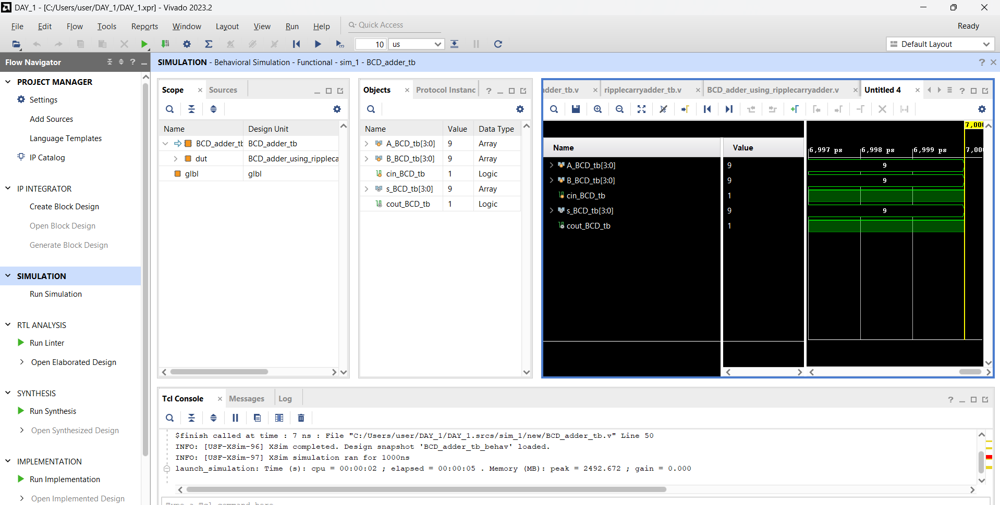

# 4-Bit Binary Coded Decimal (BCD) Adder

## 1. System Overview

This project implements a 4-Bit Binary Coded Decimal (BCD) Adder using Verilog HDL. The design performs decimal addition of two BCD digits and automatically applies correction logic whenever the binary sum exceeds the valid BCD range (0–9).

---

## 2. Working Principle

A BCD Adder first performs normal binary addition. If the resulting sum is greater than 9 or generates a carry, the correction value 0110 (decimal 6) is added to produce a valid BCD output.

---

## 3. Design Features

- Verilog HDL implementation
- BCD correction logic
- Ripple Carry Adder based architecture
- Functional verification using Vivado
- Waveform validation

---

## 4. Testbench Stimulus Profiles

The verification file (`Testbench.v`) applies various test cases to validate the functionality of the BCD Adder.

- **Test Case 1:** 3 + 4 + 0 → Sum = 7
- **Test Case 2:** 5 + 6 + 0 → Sum = 1, Carry = 1
- **Test Case 3:** 8 + 7 + 1 → Sum = 6, Carry = 1
- **Test Case 4:** 9 + 9 + 1 → Sum = 9, Carry = 1

---

## 5. Simulation Waveform

The behavioral simulation was performed using Vivado Simulator. The waveform below verifies the correct operation of the BCD Adder and confirms proper carry generation and BCD correction logic.

---

## 6. Results

The simulation results confirm that:

- The BCD Adder performs correct decimal addition.
- Invalid BCD outputs are automatically corrected.
- Carry outputs are generated correctly.
- All test cases pass successfully.

---

## 7. Conclusion

A 4-Bit BCD Adder was successfully designed and verified using Verilog HDL. The waveform results validate the correctness of the implemented architecture and correction logic.

---

## Tools Used

- Verilog HDL
- Xilinx Vivado 2023.2
- GitHub

---

## Author

**Fathima Shahana C K**  
B.Tech Electronics and Communication Engineering  
TKM College of Engineering
