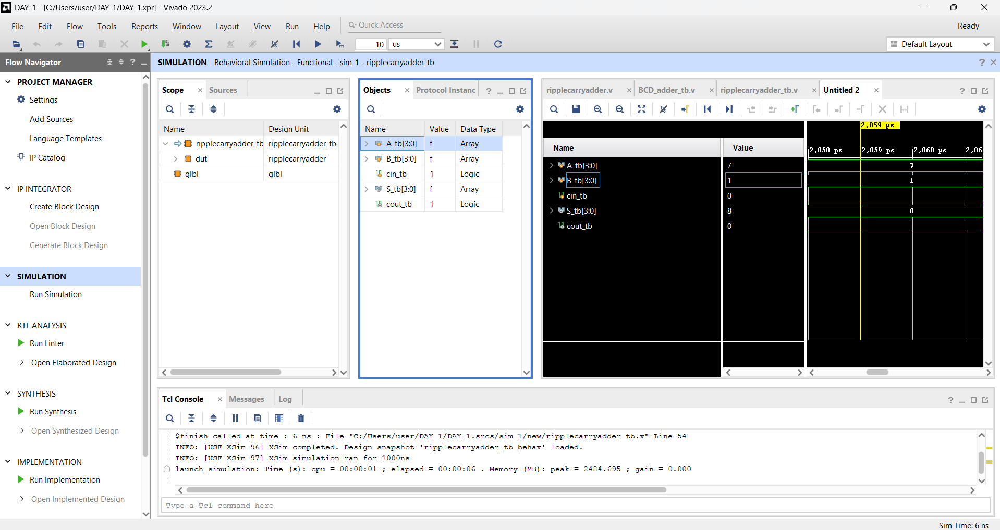

# 4-Bit Ripple Carry Adder

## 1. System Overview

This project implements a 4-Bit Ripple Carry Adder using Verilog HDL. The design performs binary addition of two 4-bit inputs along with a carry input and produces a 4-bit sum and final carry output.

A Ripple Carry Adder is constructed by connecting multiple full adders in series. The carry output from each full adder is passed to the next full adder stage.

---

## 2. Working Principle

The Ripple Carry Adder uses four full adders connected sequentially.

Each full adder performs addition of:

- One bit from input A
- One bit from input B
- Carry input from the previous stage

The carry signal propagates from the least significant bit to the most significant bit. Since the carry moves stage by stage, the circuit is called a Ripple Carry Adder.

---

## 3. Design Features

- Verilog HDL implementation
- 4-bit binary addition
- Full Adder based architecture
- Carry propagation logic
- Functional verification using Vivado
- Waveform validation

---

## 4. Testbench Stimulus Profiles

The verification file (`tb_top.v`) applies different input combinations to validate the functionality of the Ripple Carry Adder.

- **Test Case 1:** A = 0001, B = 0010, Cin = 0 → Sum = 0011, Cout = 0
- **Test Case 2:** A = 0101, B = 0011, Cin = 0 → Sum = 1000, Cout = 0
- **Test Case 3:** A = 1111, B = 0001, Cin = 0 → Sum = 0000, Cout = 1
- **Test Case 4:** A = 1111, B = 1111, Cin = 1 → Sum = 1111, Cout = 1

---

## 5. Simulation Waveform

The behavioral simulation was performed using Vivado Simulator. The waveform below verifies the correct operation of the 4-Bit Ripple Carry Adder and confirms proper sum and carry generation.

---

## 6. Results

The simulation results confirm that:

- The Ripple Carry Adder performs correct 4-bit binary addition.
- Carry propagation works correctly through all full adder stages.
- Final carry output is generated correctly.
- All test cases pass successfully.

---

## 7. Conclusion

A 4-Bit Ripple Carry Adder was successfully designed and verified using Verilog HDL. The waveform results validate the correctness of the full adder based architecture and carry propagation logic.

---

## Tools Used

- Verilog HDL
- Xilinx Vivado 2023.2
- GitHub

---

## Author

**Fathima Shahana C K**

B.Tech Electronics and Communication Engineering

TKM College of Engineering
